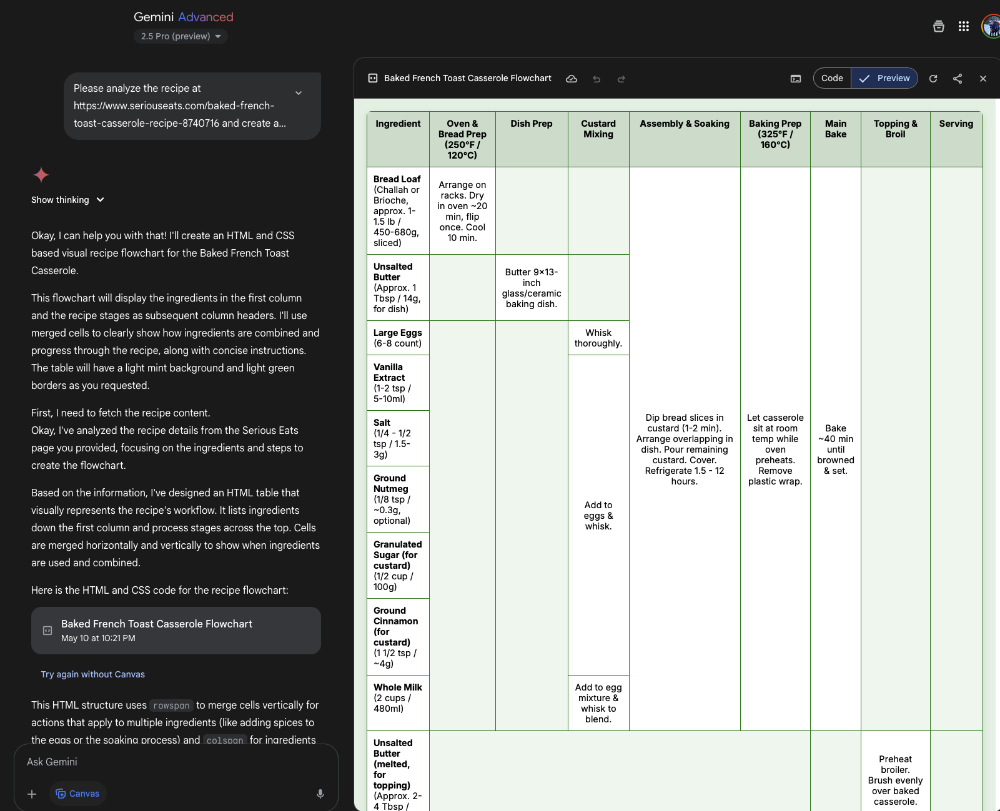

# RecipeEngineer

Food is delicious but recipes are often hard to follow. This project attempts to allow
anyone with access to an LLM the ability to modify a recipe to be easier to follow.

Please use responsibly and support your local (internet) chef still.

## Overview

Creates a table diagram to make any recipe on the web easier to follow

I was inspired by
[CookingForEngineers.com](https://www.cookingforengineers.com/recipe/230/Macaroni-and-Cheese-Bake)
and [this Threads.com
post](https://www.threads.com/@dreki/post/DJe_S36Sk28?xmt=AQF0dSKLjyodRC8Dg6o65F1DH6we4Rh3XqIhzkS3RtOyKw)

## Website Usage

Please spend a bit of time on the website reviewing it before converting it to a table
recipe. This will help with two things.

1. You will have a rough idea of the recipe and won't waste your time and food on a
   hallucination
2. You will give ad revenue to the wonderful chefs doing hard work making delicious
   meals (even if they don't know how to make a legible recipe)

## Prompts

Currently we only have a single prompt for this to work found in `basic_prompt.txt`.
Please replace `[URL]` with your desired URL.

## Tested LLMs

### Gemini 2.5 Pro

- Works Great 👍
- Preview available in chat 📺

### Gemini 2.5

- Works ok 🆗
- Preview available in chat

### Clause 3.7 Sonnet

- Works Great 👍
- Preview available in chat 📺

### ChatGPT 4o
- Works Great 👍
- No Preview in chat 🦯

## Contributing

PRs are very welcome, the goal is to make as good of a llm parser for recipes as
possible.

Please include a screenshot of the output for at least one recipe.

### Future State

- [ ] Make useable bots so that people don't have to copy paste the prompt and then add
    the url.
- [ ] Make iOS and android shortcuts so that people can send this prompt plus a URL
    to an LLM of their choice from their phone.